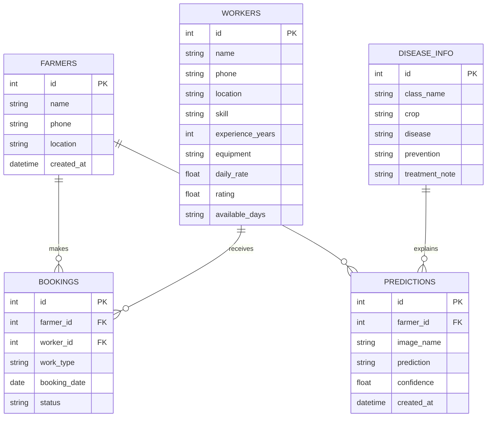

# ER DIAGRAM

```mermaid
erDiagram
    FARMERS ||--o{ BOOKINGS : makes
    WORKERS ||--o{ BOOKINGS : receives
    FARMERS ||--o{ PREDICTIONS : creates
    DISEASE_INFO ||--o{ PREDICTIONS : explains

    FARMERS {
      int id PK
      string name
      string phone
      string location
      datetime created_at
    }
    WORKERS {
      int id PK
      string name
      string phone
      string location
      string skill
      int experience_years
      string equipment
      float daily_rate
      float rating
      string available_days
    }
    BOOKINGS {
      int id PK
      int farmer_id FK
      int worker_id FK
      string work_type
      date booking_date
      string status
    }
    PREDICTIONS {
      int id PK
      int farmer_id FK
      string image_name
      string prediction
      float confidence
      datetime created_at
    }
    DISEASE_INFO {
      int id PK
      string class_name
      string crop
      string disease
      string prevention
      string treatment_note
    }
```
